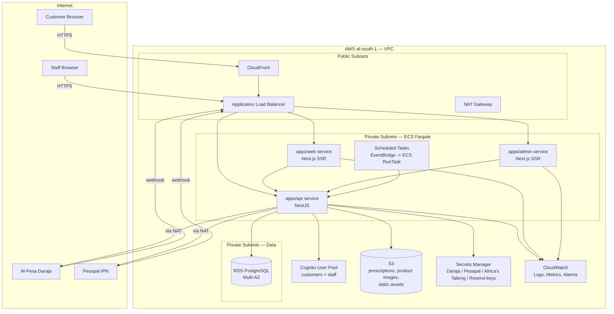

Asan Innovators | AWS Deployment Architecture & Cost Estimate — OPTEX | Version 1.0 | 2026-08-20
Prepared by: Kalyan Kumar Bedugam (AK)

# OPTEX — AWS Deployment Architecture & Costing

## 1. Overview

**Purpose.** OPTEX currently runs on Supabase (Postgres + Auth + Storage + Realtime) for data/identity and local Docker Compose for dev. This document specifies what it takes to run the full platform — `apps/api` (NestJS), `apps/web` (Next.js storefront), `apps/admin` (Next.js staff panel) — on AWS, **including a full migration off Supabase to AWS-native equivalents** (RDS for Postgres, Cognito for auth, S3 + CloudFront for storage), and gives a monthly cost estimate at current scale and at a growth-stage scale.

**Scale assumption.** No formal traffic target has been set for OPTEX yet (single-market Kenya launch, per `OPTEX-SOW-2025-001-KE v3.0`). This doc sizes infrastructure for an **early-stage production launch** (low thousands of monthly orders, a few staff users across ~7 RBAC roles, modest catalog/traffic) and gives a second **growth-stage** column for planning. Treat both as directional — see §11 for how to get a binding quote.

**Region.** AWS has one region in Africa: **`af-south-1` (Cape Town)**. It's the lowest-latency AWS region to Kenya but is a newer, smaller region — fewer services, and list prices run **~20–30% above `us-east-1`/`eu-west-1`**. Recommendation: **`af-south-1` as primary** for latency (M-Pesa Daraja and Pesapal webhooks, customer-facing pages), with the option to fall back to `eu-west-1` (Ireland) if a needed service isn't available there yet or cost becomes the deciding factor. All estimates in §11 use `af-south-1`-adjusted pricing.

**Deployment environment.** ECS Fargate (containers) behind an Application Load Balancer, chosen over serverless (Amplify/Lambda) for operational consistency across all three apps and predictable performance for the NestJS API's cron jobs (`@nestjs/schedule`) and Pino-based structured logging — both awkward fits for Lambda's execution model.

---

## 2. Migration Scope — What Actually Changes

This is a **full re-platform**, not a lift-and-shift. Supabase isn't just a hosting choice here — the schema and API are built directly on Supabase-specific primitives, per `CLAUDE.md`:

| Supabase-specific thing in the codebase today | What replaces it on AWS |
|---|---|
| `auth.jwt()`, `auth.uid()` used throughout RLS policies (`Backend/supabase/migrations/0001`–`0025`) | Rewritten as RDS RLS policies driven by a `current_setting()` session variable the API sets per-request from the verified Cognito JWT (Postgres RLS still works on RDS — it's a Postgres feature, not a Supabase one — but the claim source changes) |
| `is_super_admin()` SECURITY DEFINER function checking **`app_metadata.role`** (`0007_security_meta.sql`) | Re-implemented against Cognito's `custom:role` / `custom:branch_id` **custom attributes**, set server-side only via `AdminUpdateUserAttributes` (Cognito's equivalent of Supabase's server-only `app_metadata`) |
| GoTrue TOTP enrollment/challenge for Super Admin `aal2` step-up (`apps/admin/middleware.ts`, `mfa-enforcement.e2e-spec.ts`) | Cognito **software-token MFA**, enforced via a custom `aal`-equivalent claim in the ID token, checked the same two places (admin middleware + `PermissionsGuard`) |
| Supabase Storage `prescriptions` bucket, private, signed URLs from `prescriptions.service.ts` | S3 bucket with **block-all-public-access**, ownership check unchanged in `prescriptions.service.ts`, swap the Supabase signed-URL call for an S3 **presigned GET URL** (same 60s expiry) |
| `place_order`, `try_claim_cron_run`, `claim_due_reminders`, `increment_promo_uses` — Postgres functions/RPCs called via `supabase-js` | Unchanged as Postgres functions — RDS is still Postgres. Only the client call changes (`pg`/Prisma/Kysely direct connection instead of PostgREST RPC) |
| Server Components in `apps/web` reading Supabase **directly** for SSR/SEO pages | Must go through the API instead, or read RDS directly via a server-side Postgres client with the same RLS session-variable pattern — **this is the highest-effort item**, touching every SSR page listed in `CLAUDE.md`'s `apps/web/` description |
| Local dev stack (`docker-compose.yml`, `docker/migrate.sh`) built around `supabase/postgres`, `gotrue`, `postgrest`, `storage-api`, Kong | Replaced with plain Postgres for local dev (or LocalStack for AWS service emulation) — the whole Kong/GoTrue/PostgREST stack goes away, which simplifies `docker-compose.yml` considerably |
| Payment webhooks (M-Pesa Daraja, Pesapal IPN) using the Supabase **service-role key** to bypass RLS | Webhook handlers connect to RDS with a dedicated low-privilege IAM-authenticated DB role scoped to just the tables they write, instead of a blanket service-role bypass |

**Net effect:** every one of the 25 migrations in `Backend/supabase/migrations/` needs to be re-audited for Supabase-specific SQL before it's replayed against RDS. Budget this as its own engineering phase before touching hosting — see §12 (Risks).

---

## 3. Architecture Diagram

---

## 4. AWS Services Per Component

| Component | AWS Service(s) | Why |
|---|---|---|
| `apps/api` (NestJS) | ECS Fargate + ALB target group | Long-running Node process, cron jobs (`@nestjs/schedule`), webhook receivers — needs always-on compute, not request-scoped Lambda |
| `apps/web` (storefront) | ECS Fargate + ALB target group, CloudFront in front for static assets | Next.js SSR for SEO pages needs a server; CloudFront caches `_next/static`, images |
| `apps/admin` (staff panel) | ECS Fargate + ALB target group (separate, lower-traffic) | Internal-only, can run on smaller task size; still SSR so not a pure static host |
| Container images | ECR (one repo per app) | Already have `apps/api/Dockerfile`; add equivalents for `web`/`admin` |
| Database | RDS for PostgreSQL, Multi-AZ, encrypted at rest | Replaces Supabase Postgres; Multi-AZ for the payment/checkout path's availability needs |
| Auth (customers + staff) | Cognito User Pool, two app clients, custom attributes for `role`/`branch_id`, software-token MFA for Super Admin | Replaces Supabase Auth/GoTrue; supports the `app_metadata`-equivalent server-set claim pattern R1 depends on |
| File storage | S3 (private buckets: `prescriptions`, `product-images`, `static`) | Replaces Supabase Storage; presigned URLs replace signed URLs |
| CDN | CloudFront | In front of S3 (product images) and the web app's static assets |
| Secrets | Secrets Manager | M-Pesa Daraja, Pesapal, Africa's Talking, Resend API keys — never in env files in the container image |
| Scheduled jobs | Amazon EventBridge Scheduler → ECS `RunTask` | Replaces the advisory-lock leader election (`try_claim_cron_run`) for reminder sweeps, notification retries — EventBridge triggers a one-off task instead of an always-running scheduler process, though the advisory-lock pattern stays as a safety net for overlapping runs |
| Networking | VPC, 2 public + 2 private subnets (Multi-AZ), NAT Gateway, Security Groups | Fargate tasks and RDS stay private; only the ALB is internet-facing |
| DNS | Route 53 | `optexopticians.co.ke` (or equivalent) hosted zone, records for web/admin/API subdomains |
| Edge protection | AWS WAF on the ALB/CloudFront | Rate-limiting, managed rule sets (SQLi/XSS) in front of checkout and admin login |
| CI/CD | CodePipeline + CodeBuild, or GitHub Actions (existing `.github/workflows/ci.yml`) pushing to ECR and updating ECS services | Reuses the existing 3-job CI setup — see §8 |
| Monitoring | CloudWatch Logs, Metrics, Alarms, Container Insights | See §9 |
| IaC | Terraform or AWS CDK | Not optional at this service count — manual console setup won't stay reproducible across `staging`/`prod` |

---

## 5. Tech Stack — Before / After

| Layer | Current (Supabase) | AWS-native |
|---|---|---|
| Database | Supabase Postgres 15 | RDS PostgreSQL 15/16, Multi-AZ |
| Auth | Supabase Auth (GoTrue), `app_metadata` claims, TOTP via GoTrue | Cognito User Pool, custom attributes, software-token MFA |
| Storage | Supabase Storage, signed URLs | S3, presigned URLs |
| Realtime | Supabase Realtime (not currently used per `CLAUDE.md`) | Not provisioned — add API Gateway WebSockets or AppSync only if/when a realtime feature is actually built |
| API gateway | Kong (local dev only) | ALB (production), no API Gateway needed since NestJS handles routing |
| Compute | Node processes in Docker Compose (dev), unspecified prod host | ECS Fargate |
| Secrets | `.env` files | Secrets Manager + ECS task-level secret injection |
| Payments | M-Pesa Daraja + Pesapal (unchanged) | Unchanged — external providers, not part of this migration |
| Notifications | Africa's Talking SMS + Resend email (unchanged) | Unchanged — external providers |

---

## 6. Data Model & Migration Approach

- Schema is unchanged — RDS runs the same 25 migrations (`0001_init_schema.sql` → `0025_rbac_foundation.sql`), **after** the Supabase-specific SQL identified in §2 is rewritten (primarily `auth.jwt()`/`auth.uid()` references and the two `is_super_admin()`/`current_customer_id()` SECURITY DEFINER functions).
- Migration path: stand up RDS in parallel, replay the rewritten migration set, backfill via `pg_dump`/`pg_restore` from the Supabase instance, cut over with a maintenance window (checkout and appointment booking briefly read-only).
- RLS stays enabled on RDS — Postgres RLS is not a Supabase feature, so the "defense-in-depth" posture from `0009`'s philosophy carries over unchanged; only the claim source (Cognito JWT via session variable, not `auth.jwt()`) changes.
- `staff_users`, `audit_log`, `role_permissions` tables and R1's whole RBAC model are unaffected by the auth-provider swap — they key off `role`/`branch_id`, which now come from Cognito custom attributes instead of Supabase `app_metadata`.

---

## 7. Key Flows

**Auth (customer or staff login).** Client → Cognito (`InitiateAuth`) → Cognito issues ID/access/refresh tokens → API verifies the ID token (Cognito's public JWKS) on every request → API reads `custom:role`/`custom:branch_id` from the verified token → sets the Postgres session variable RLS policies check → runs the query.

**Super Admin step-up (`aal2` equivalent).** Login succeeds at password-only assurance → `PermissionsGuard` (API) and `middleware.ts` (admin app) both check for a custom `mfa_verified`/software-token claim → if absent, admin app redirects to `/mfa-challenge` → Cognito `RespondToAuthChallenge` with the TOTP code → new token carries the elevated claim → both enforcement points now pass, matching the existing "two enforcement points" design so a valid-but-unverified token still can't reach a privileged route directly.

**Checkout (payment webhook).** Customer places order → `place_order` RPC (unchanged Postgres function) locks inventory, creates the order row → M-Pesa/Pesapal webhook hits the ALB → routed to `apps/api` → API writes to `mpesa_transactions`/`pesapal_transactions` using a scoped IAM-authenticated DB role (not a blanket service-role bypass) → `AuditLogService.record()` still fires as it does today.

**Scheduled jobs (reminders, cron sweeps).** EventBridge Scheduler fires on a fixed interval → triggers `ecs:RunTask` for a one-off API container invoking the relevant sweep (`claim_due_reminders`, notification retry) → the existing `try_claim_cron_run` advisory lock stays as a safety net in case two invocations overlap, but EventBridge's own scheduling removes the need for an always-running scheduler process.

**Prescription upload/download.** (Currently backend-only per `CLAUDE.md` — no storefront UI calls this yet.) Once built: client requests a presigned S3 PUT URL from the API → uploads directly to S3 → API records the object key, namespaced by customer ID as today → download requests go through the same ownership check in `prescriptions.service.ts`, now issuing an S3 presigned GET instead of a Supabase signed URL.

---

## 8. CI/CD Pipeline Design

Reuses the existing `.github/workflows/ci.yml` (three jobs: `static`, `e2e`, `smoke`) rather than replacing it — adds a fourth stage after `static`/`e2e` pass:

1. **`static` + `e2e` + `smoke`** — unchanged, run exactly as they do today.
2. **`build-and-push`** (new) — on merge to `main`: build each app's Docker image (`apps/api/Dockerfile` exists; add `apps/web/Dockerfile`, `apps/admin/Dockerfile` as multi-stage Next.js standalone builds), tag with the git SHA, push to each app's ECR repo.
3. **`deploy-staging`** (new) — auto-deploy every `main` merge to the `staging` ECS services (`aws ecs update-service --force-new-deployment`), run the Playwright smoke suite against staging.
4. **`deploy-prod`** (new) — manual approval gate (GitHub Environments), then the same ECS update against `prod` services. Deployment strategy: ECS **rolling update** with a minimum-healthy-percent of 100% (no downtime) — blue/green (via CodeDeploy) is a reasonable upgrade once traffic justifies it.
5. **Rollback** — re-point the ECS service at the previous task definition revision (one command, ECS keeps revision history automatically); RDS changes go through reviewed migrations only, no auto-rollback for schema.

Admin Playwright suite (`apps/admin/e2e/`, currently local-only per `CLAUDE.md`) should be added to the `smoke` job or a new `admin-smoke` job at the same time as this migration — it already does real TOTP enrollment against GoTrue; swapping to Cognito's software-token MFA API is a natural point to also wire it into CI.

---

## 9. Security Architecture

- **Network isolation**: ECS tasks and RDS live in private subnets with no direct internet route; only the ALB (public subnet) is internet-facing. Egress to Daraja/Pesapal/Africa's Talking/Resend goes through the NAT Gateway.
- **Secrets**: M-Pesa, Pesapal, Africa's Talking, and Resend credentials live in Secrets Manager, injected into ECS tasks as secrets (not environment variables baked into the image). Rotation policies configured per secret.
- **IAM**: least-privilege task roles per service — the API's task role can read the specific secrets it needs and write to the specific S3 buckets/RDS role it needs, nothing broader. No service reuses the old "service-role bypasses everything" pattern; that gets scoped down per §2/§6.
- **WAF**: managed rule groups (`AWSManagedRulesCommonRuleSet`, `AWSManagedRulesSQLiRuleSet`) plus a rate-based rule on `/checkout` and `/admin/login` to blunt credential-stuffing and checkout abuse.
- **Encryption**: RDS encrypted at rest (KMS), S3 buckets encrypted at rest + block-public-access on all four buckets, TLS everywhere (ALB listener certs via ACM, RDS `sslmode=require`).
- **MFA**: Cognito software-token MFA mandatory for the Super Admin role, mirroring the current GoTrue TOTP enforcement — enforced at both the admin app's middleware and the API's `PermissionsGuard`, so a stolen-but-unverified token still can't reach privileged routes.
- **Audit trail**: `audit_log` table and `AuditLogService.record()` are unchanged; CloudTrail added on top for AWS-API-level audit (who changed a security group, who touched Secrets Manager) — a layer OPTEX didn't have before since Supabase's control plane wasn't self-managed.

---

## 10. Monitoring & Alerting

- **CloudWatch Container Insights** on the ECS cluster — CPU/memory per service, task restart counts.
- **CloudWatch Logs**: each service's Pino JSON logs shipped via the `awslogs` driver, one log group per service, retained 30 days (90 for `audit_log`-adjacent API logs, matching typical compliance expectations for a payments-handling system).
- **Alarms** (SNS → email/Slack): ALB 5xx rate, ECS service unhealthy task count, RDS CPU/storage/connection count, NAT Gateway error rate, EventBridge scheduled-task failures (reminder/cron sweeps going silent is exactly the kind of regression `0022_reminder_flag_claim.sql` was built to prevent — don't lose that guarantee on the infra side).
- **RDS Performance Insights** enabled — cheap, and the fastest way to catch a slow query before it becomes a checkout-path incident.
- **Synthetic checks**: CloudWatch Synthetics canary hitting the storefront health endpoint and the API's `/health` (Terminus-based) every 5 minutes from `af-south-1`.

---

## 11. AWS Cost Estimate (Monthly, USD)

All figures are **AWS on-demand public list-price estimates for `af-south-1`**, built from `us-east-1`/`eu-west-1` baseline pricing with a ~20–25% regional premium applied. They are planning-grade, not a quote — see §13 for how to firm these up. KES conversion shown at an indicative ~130 KES/USD; confirm the live rate before budgeting.

| Item | Production (early-stage) | Staging | Notes |
|---|---:|---:|---|
| ECS Fargate — `apps/api` (2 tasks, 0.5 vCPU/1GB) | $45 | — | 2 tasks for basic HA |
| ECS Fargate — `apps/web` (2 tasks, 0.5 vCPU/1GB) | $45 | — | SSR, customer-facing |
| ECS Fargate — `apps/admin` (1 task, 0.25 vCPU/0.5GB) | $11 | — | Low traffic, internal only |
| ECS Fargate — staging (all 3 apps, 1 task each, smallest size) | — | $34 | Shared minimal staging stack |
| Application Load Balancer(s) | $35 | $22 | Base + LCU usage |
| RDS PostgreSQL Multi-AZ (`db.t4g.medium`, 100GB gp3) | $170 | — | Multi-AZ for prod HA |
| RDS PostgreSQL single-AZ (`db.t4g.small`, 20GB gp3) | — | $40 | No HA needed for staging |
| NAT Gateway (data processing + hourly) | $50 | $35 | Recurring cost that's easy to underestimate — see note below |
| Cognito User Pool | $0–15 | $0 | Free up to 50,000 MAUs on the Essentials tier; add-on for advanced security features if enabled |
| S3 (prescriptions, product images, static) | $12 | $3 | Storage + requests, modest scale |
| CloudFront | $22 | $5 | CDN for storefront static assets + product images |
| ECR | $4 | — | 3 repos, image storage |
| Secrets Manager | $5 | $2 | ~10 secrets across both environments |
| CloudWatch (Logs, Metrics, Alarms, Container Insights) | $28 | $10 | Log retention + Container Insights adds up faster than metrics alone |
| Route 53 | $2 | — | 1 hosted zone + query volume |
| AWS WAF | $18 | — | Base + managed rule groups + request volume; skip on staging |
| Data transfer / misc | $18 | $8 | Cross-AZ, egress buffer |
| **Subtotal** | **≈ $465/mo** | **≈ $159/mo** | |
| **Combined (staging + prod)** | | **≈ $624/mo (~KES 81,000/mo)** | |

**Growth-stage estimate** (traffic and catalog roughly 4–5x current scale — matching the kind of target a 50K-user product plan would set): Fargate task counts double, RDS steps up to `db.r6g.large` Multi-AZ, NAT/CloudFront data transfer scales with traffic, WAF request volume rises.

| Item | Growth-stage production |
|---|---:|
| ECS Fargate (all 3 apps, doubled capacity) | $220 |
| ALB | $70 |
| RDS PostgreSQL Multi-AZ (`db.r6g.large`) | $480 |
| NAT Gateway | $110 |
| Cognito (past free tier, advanced security on) | $60 |
| S3 | $35 |
| CloudFront | $90 |
| CloudWatch | $55 |
| WAF | $35 |
| Misc | $45 |
| **Subtotal** | **≈ $1,200/mo (~KES 156,000/mo)** |

**Cost-saving levers, once traffic is stable enough to commit:**
- Fargate **Compute Savings Plans** (1-year, no upfront) — typically 20–30% off on-demand.
- RDS **Reserved Instance** — typically 30–40% off on-demand for a 1-year term.
- Collapse staging's NAT Gateway into a **NAT instance** or route via VPC endpoints for AWS-service traffic (S3, Secrets Manager, ECR) to cut the NAT bill — NAT Gateway is consistently the line item teams underestimate.
- Single shared ALB with host-based routing across `web`/`admin`/`api` instead of one ALB per service, if the current design uses separate ones — cuts the base ALB charge to one instance.

---

## 12. Constraints and Locked Decisions

- Region: `af-south-1` primary, `eu-west-1` fallback if a needed AWS service isn't available there.
- Compute: ECS Fargate + ALB (not Lambda/Amplify) — decided for operational consistency with the NestJS cron/webhook workload.
- Full migration off Supabase: RDS + Cognito + S3, not a hybrid (this was an explicit scope choice — see §2 for what that actually touches).
- Payment/notification providers (M-Pesa Daraja, Pesapal, Africa's Talking, Resend) stay external and unchanged — out of scope for this migration.
- IaC required (Terraform or CDK) — not optional given the service count.

---

## 13. Open Questions and Risks

1. **Biggest single risk: RLS/claims rewrite.** Every policy referencing `auth.jwt()`/`auth.uid()` and both SECURITY DEFINER functions (`is_super_admin()`, `current_customer_id()`) needs rewriting and re-testing against the full 183-test API e2e suite before cutover — this is a multi-week effort on its own, independent of standing up AWS infrastructure.
2. **`apps/web`'s direct-Supabase-read SSR pages.** `CLAUDE.md` describes Server Components reading Supabase directly for SEO pages. On RDS, these either route through the API (adds a hop, changes the SSR performance profile) or connect to RDS directly with the same RLS session-variable pattern the API uses — needs a design decision before implementation starts, not during.
3. **Cognito MFA parity.** Confirm Cognito's software-token MFA challenge flow can be scripted the same way `apps/admin/e2e/global-setup.ts` currently does a real TOTP enrollment against GoTrue — if not, the admin Playwright suite's fixture setup needs rework alongside the auth migration.
4. **Cutover window for the payments path.** `place_order`, M-Pesa/Pesapal webhook handling, and `mpesa_transactions`/`pesapal_transactions` writes need a coordinated cutover — a half-migrated state where webhooks land on the old DB while checkout reads the new one is the failure mode to design against explicitly.
5. **These are estimates, not a quote.** Before committing budget, run the exact instance sizes/counts above through the **AWS Pricing Calculator** (calculator.aws) for `af-south-1`, and — if OPTEX's transaction volume is meaningful — talk to an AWS account team about Activate credits (startups) or negotiated Enterprise Discount Program pricing.
6. **Prescription upload UI gap** (noted in `CLAUDE.md` as a known gap, unrelated to AWS) — worth deciding whether it gets built before or after this migration, since it changes the S3 bucket's access pattern from "backend-only, tested" to "customer-facing upload flow."

---

Confidential — Asan Innovators © 2026 | Building Beyond Boundaries
